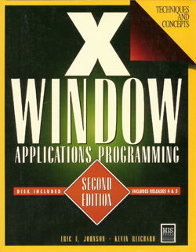

# x-window-apps
Source code from "X Window Application Programming" (1992).

The original book's source code provided on floppy is available [here](X-Window-Applications-Programming.img).

This repo is an upgrade of the code from K&R to ANSI89 with some edits of my own.

The code is old and I'm prone to mistakes, so I can't guarentee anything here is free of errors.

## Book Information

| __Title__            | [X Window Applications Programming, 2nd Edition](https://www.amazon.com/gp/product/1558281800) |
| :------------------- | :--------------------------------------------- |
| __Author__           | Johnson, Eric F.                               |
| __ISBN__             | 9781558281806                                  |
| __Publication Year__ | 1992                                           |
| __Publisher__        | MIS Press                                      |
| __Format__           | Hardcover                                      |
| __Genre__            | Non-Fiction                                    |
| __Subject__          | Programming                                    |
| __Description__      | X-Window was early graphical interface designed to be portable across many kinds of computers without concern with the hardware. The system facilitated the development of distributed computing. The book provides example programs and tutorials writing programs with X and building complete applications. Much of the development of the was done at MIT in Project Athena. |
